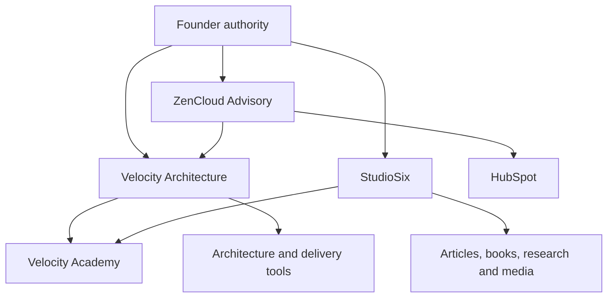
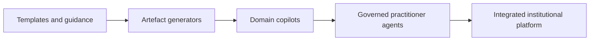
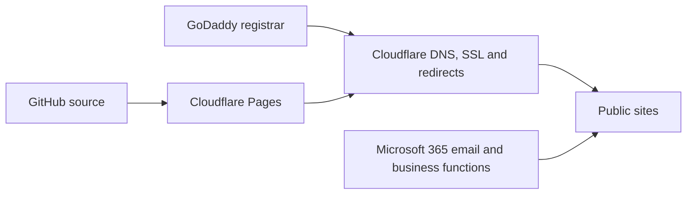

# Visible Ecosystem Continuity Handoff — 2026-06-08

## Purpose

This document preserves the public-safe strategic and architectural continuity exposed across the visible professional project threads reviewed on 8 June 2026. It complements the private Obsidian continuity graph; it does not replace the owning repositories or the confidential historical source ledger.

## Authority model

- GitHub owns implementation, accepted doctrine, frameworks, artefacts, research, books, product documentation, deployment evidence and release history.
- Obsidian owns relationship memory, founder continuity, cross-domain synthesis, source coverage, contradictions, incubator options and archive control.
- Magister Automatorum governs estate boundaries and release authority.
- The owning repository remains authoritative for its product or method.
- Client evidence remains inside its authorised Archivum boundary.
- Conversations are temporary operational surfaces.

## Operating model

> Obsidian governs. ZenCloud advises. Velocity decides. StudioSix produces. GitHub proves. HubSpot converts.

For continuity:

> Obsidian relates. GitHub proves. Magister governs. Memoria contextualises. Archivum preserves accepted evidence.

## Public ecosystem



## Institutional relationship

```text
Velocity Architecture defines.
Lex governs.
Ordo Animi enforces.
Probatio proves.
Archivum remembers.
Exportum transfers.
Custos explains.
```

Magister Automatorum governs estate boundaries. Memoria owns approved and consented runtime context. Newer institutional components must be assigned roles through accepted authority records rather than inferred from names.

## Durable strategic doctrine

1. Architecture is a decision system, not an artefact-production function.
2. Intent, authority, guardrails, evidence and feedback must remain connected to delivery.
3. Tools should evolve from templates to generators, copilots and governed practitioner agents without overstating autonomy.
4. Public claims must not exceed verified implementation and deployment evidence.
5. Learning, publishing, advisory and tooling operate as one flywheel.
6. Client-specific information remains client-controlled; only anonymised and generalised patterns may inform framework development.
7. Personal trading and labs remain bounded from enterprise advisory positioning.
8. Repository identity, route maps, licences, deployment records and release status are product controls.
9. External frameworks may inform patterns but proprietary diagrams, language, certification claims and branding must not be copied.
10. Threads become archive candidates only after durable value, unresolved items and authority placement are recorded.

## Core framework model

### Four operating domains

- Enterprise Architecture
- Business Architecture
- Solution Architecture
- PMO / Programme Delivery

### Cross-cutting lenses

- Business value
- Data readiness
- Security risk
- AI readiness
- Governance and traceability

### Decision chain

```text
Intent → decision → guardrail → artefact → control → evidence → feedback
```

## Product portfolio direction



The current tool family includes enterprise, solution, business and project-management artefact generators, VAF-SA, PMO Portal, VSF tools and the VAF Agentic Architect. Human review and professional accountability remain mandatory.

## Academy and knowledge architecture

```text
Public essays and Medium series = live manuscript stream
Library and books = structured long-form knowledge
Courses = guided learning pathways
Resources = reusable working artefacts
Certification = assessed evidence
Tools = operationalised methods
```

`Reading the Map` is an expandable library collection and is not limited to the twelve-module Enterprise Architecture Foundations course. Series 4, Architecture as a Decision System, is public; Series 5, The Implementation Arc, remains forthcoming.

## Deployment architecture



Static sites use GitHub and Cloudflare Pages with no build command where appropriate. React/Vite sites use a repeatable build and `dist` output. DNS changes must preserve Microsoft 365 records.

## Major corrections converted into controls

| Failure | Durable control |
|---|---|
| Nested pages lost styling | Use canonical root stylesheet paths on public custom-domain sites |
| Relative navigation failed across folders | Use root-relative routes and maintain a site map |
| Long coding prompts exhausted agents | Execute internally in resumable phases without returning routine control to the founder |
| Work proceeded from stale assumptions | Inspect authoritative repository state before modification |
| READMEs and identities drifted | Verify repository identity and documentation during release signoff |
| Founder received commands despite authorised tools | Tool-enabled operating agents execute directly and prompt only at real authority boundaries |
| Product claims outran evidence | Release language follows route, mode, source, timestamp, limitations and validation evidence |
| Polish advanced around broken essentials | Critical-path requirements block nonessential expansion |

## Current durable project states

- Velocity Academy has a static university shell, Knowledge Portal, Library, resources and pilot certification pages.
- Enterprise Architecture Foundations has twelve applied modules covering ADM, Architecture Vision, BDAT, options and roadmaps, UML, ArchiMate, capability mapping, executive packs and final assessment.
- ZenCloud Advisory is the commercial front door and is moving from Squarespace toward a GitHub and Cloudflare Pages model.
- Archivum has an accepted client-isolated evidence lifecycle and deliberately excludes portal, authentication and adapter capabilities from its current baseline.
- Lex is the structured policy-control registry and is not a legal-advice or certification service.
- The artefact-generator portfolio is converging toward governed domain copilots and practitioner agents.
- The Academy and certification estate includes enterprise architecture, solution architecture, Azure, SAP EA, security, agentic AI and software-learning pathways.

## Preserved unfinished concepts

- EA and SA copilots evolving into governed senior-practitioner agents.
- Shared schema and governance across enterprise, business, solution and PM artefact tools.
- Architecture Intent Canvas derived from Commander’s Intent.
- Executable architecture governance, machine-readable decisions and architecture fitness functions.
- Velocity as a decision layer beside scaled-delivery frameworks such as SAFe.
- Reading the Map as a 50-plus-chapter knowledge collection.
- Series 5 — The Implementation Arc.
- Partner and certified-practitioner network.
- Archivum portal, authentication, repository provisioning and enterprise adapters.
- Lex jurisdiction, data-location, AI-provider and evidence controls.
- Complete Ordo Animi component and authority map.
- VALOUR evidence and institutional-limb integration.

## Coverage boundary

This handoff covers the professional and ecosystem context exposed to the current working session. It does not claim review of every historical ChatGPT, Claude, Copilot, Codex, meeting or deleted conversation. Unavailable sources remain blocked in the private historical source coverage ledger until exposed or exported and reconciled under the historical migration control.